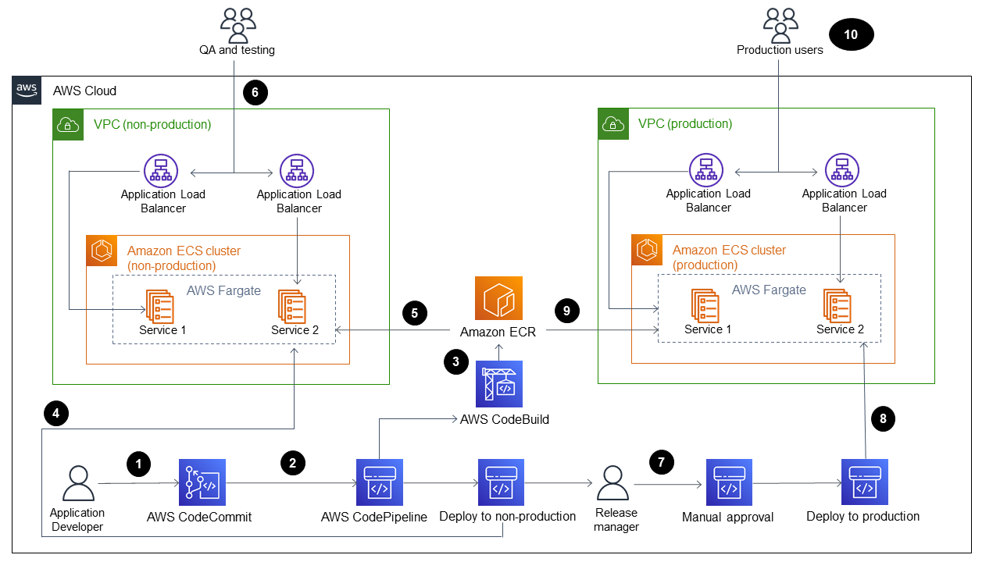
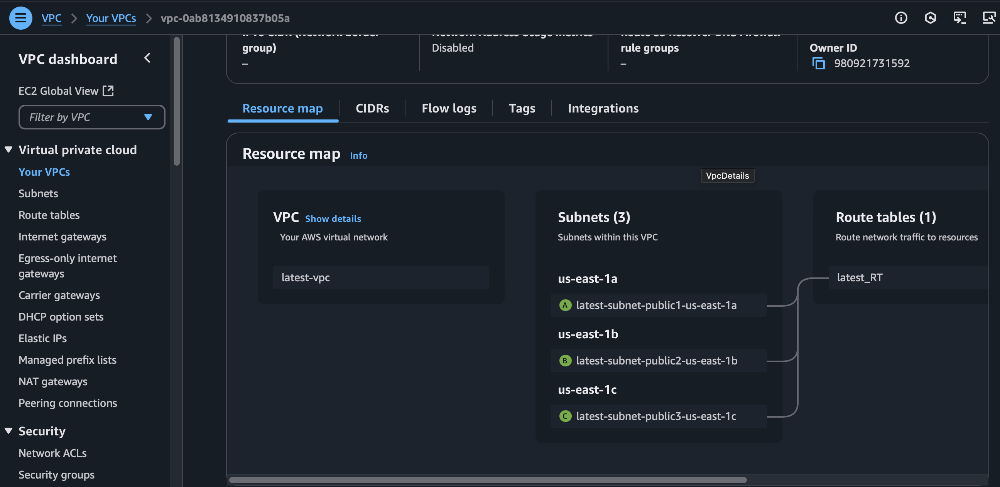
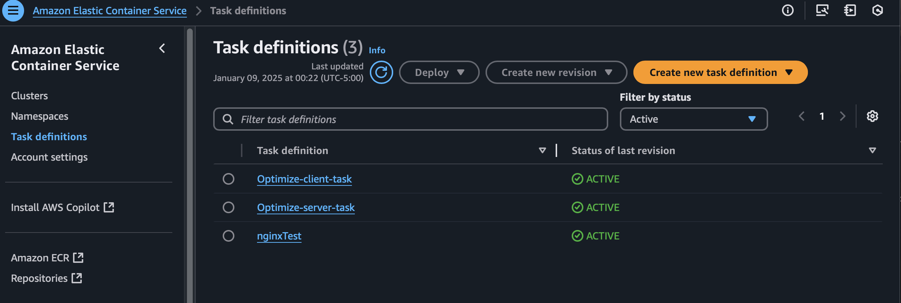
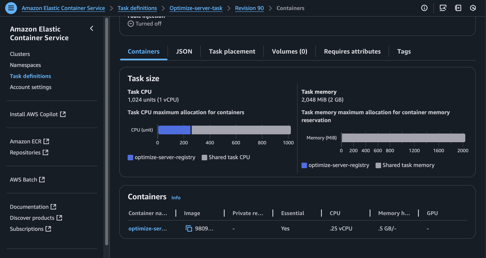
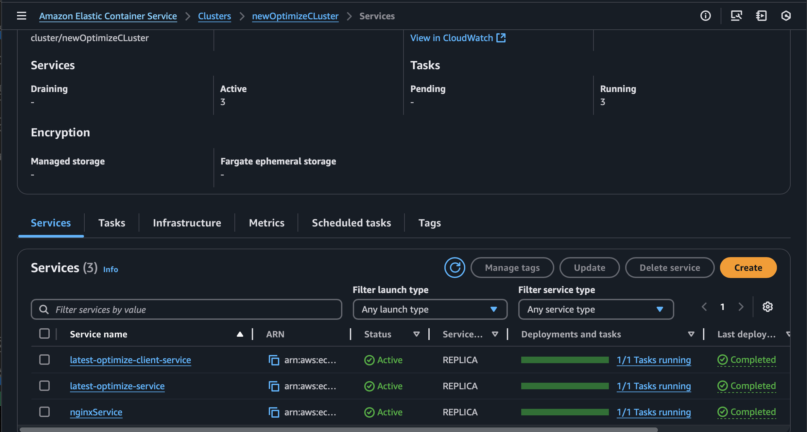
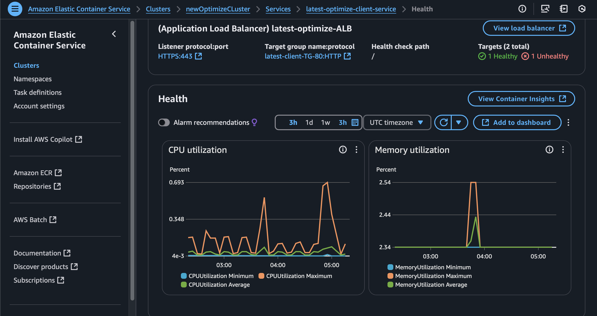
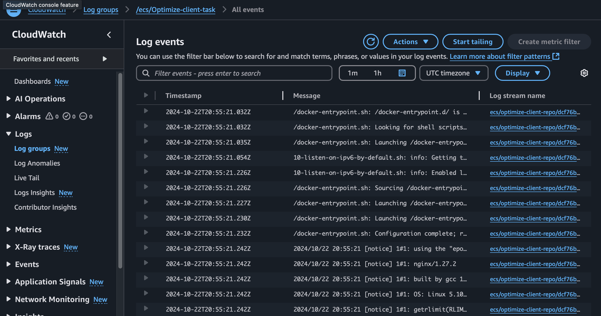

# AWS CI/CD Setup for Optimize/Employee Management App

This repository documents the comprehensive setup of the AWS CI/CD pipeline for the Optimize/Employee Management app. This documentation includes step-by-step configurations, key learnings, and troubleshooting notes to serve as a future reference.



---

## Table of Contents

- [Introduction](#introduction)
- [AWS Services Utilized](#aws-services-utilized)
- [VPC Setup](#vpc-setup)
- [Security Groups](#security-groups)
- [HTTP to HTTPS Redirection](#http-to-https-redirection)
- [ECS Task Definition](#ecs-task-definition)
- [ECS Service and Cluster Setup](#ecs-service-and-cluster-setup)
- [Amazon S3 for Picture Storage](#amazon-s3-for-picture-storage)
- [CodeBuild Configuration](#codebuild-configuration)
- [Monitoring and Logging](#monitoring-and-logging)
- [Key Learnings](#key-learnings)
- [Future Improvements](#future-improvements)

---

## Introduction

The Optimize/Employee Management app is a scalable, cloud-based solution deployed in AWS. This documentation highlights the CI/CD pipeline setup, key configurations, and best practices used to deploy and manage the application.

The application architecture includes:

- **Frontend**: Built with **React**, providing a responsive and dynamic user interface.
- **Backend**: Developed using **Spring Boot**, offering robust APIs and handling business logic.
- Both components are containerized and deployed on AWS ECS using Fargate, integrated with an Application Load Balancer for secure and efficient traffic management.

---

## AWS Services Utilized

- **[Amazon Elastic Container Registry (ECR)](https://aws.amazon.com/ecr/)**: Stores Docker images.
- **[Amazon Elastic Container Service (ECS)](https://aws.amazon.com/ecs/)**: Runs containerized tasks using Fargate.
- **[Application Load Balancer (ALB)](https://aws.amazon.com/elasticloadbalancing/application-load-balancer/)**: Routes traffic securely to ECS tasks.
- **[Amazon S3](https://aws.amazon.com/s3/)**: Stores application pictures and files.
- **[AWS CodePipeline](https://aws.amazon.com/codepipeline/)**: Automates the CI/CD process.
- **[AWS CodeBuild](https://aws.amazon.com/codebuild/)**: Builds and tests the application.
- **[Amazon CloudWatch](https://aws.amazon.com/cloudwatch/)**: Monitors logs and metrics.
- **[AWS Route 53](https://aws.amazon.com/route53/)**: Manages domain and DNS (e.g., `optimizeservice.net`).

---

## VPC Setup



1. **VPC Creation**:

   - **CIDR Block**: `10.0.0.0/16`.
   - **DNS Settings**: Enabled DNS resolution and DNS hostnames.

2. **Subnets**:

   - Created three public subnets across availability zones:
     - Subnet 1: `us-east-1a`
     - Subnet 2: `us-east-1b`
     - Subnet 3: `us-east-1c`

3. **Internet Gateway**:

   - Attached to the VPC for internet access.

4. **Route Tables**:
   - Configured a public route table to direct traffic to the Internet Gateway.

---

## Security Groups

1. **ALB Security Group**:

   - Inbound:
     - HTTP (Port 80) from `0.0.0.0/0`.
     - HTTPS (Port 443) from `0.0.0.0/0`.
   - Outbound:
     - All traffic to `0.0.0.0/0`.

2. **ECS Task Security Group**:
   - Inbound:
     - TCP (Port 80) from ALB security group.
     - TCP (Port 8080) for internal communication.
   - Outbound:
     - All traffic to `0.0.0.0/0`.

---

## HTTP to HTTPS Redirection

1. Configured SSL certificate in **AWS Certificate Manager (ACM)** for the domain.
2. Created ALB listeners:
   - Listener 1 (Port 80): Redirect HTTP to HTTPS.
   - Listener 2 (Port 443): Forward requests to ECS target group.

---

## ECS Task Definition



1. **Container Configuration**:
   - Image: `########.dkr.ecr.us-east-1.amazonaws.com/optimize-server-registry:latest`.
   - Port: `80`.
   - Environment Variables: Included secrets like database credentials and API URLs.
2. **Resource Allocation**:
   - Defined CPU and memory limits.



3. **IAM Role**:
   - `ecsTaskExecutionRole` with necessary permissions for ECS and ECR.

---

## ECS Service and Cluster Setup



1. **Task Definition**:

   - Defined the task requirements, including container images, ports, and environment variables.
   - Ensured proper IAM role assignment to allow ECS to pull images from ECR and access other AWS resources securely.

2. **Cluster Setup**:

   - Created the ECS cluster named `Optimize-cluster`.
   - Configured the cluster to support Fargate tasks for serverless container management.

3. **Service Configuration**:

   - Created an ECS service (`Optimize-server-service-v1`) with the following:
     - **Launch Type**: Fargate.
     - **Desired Count**: 2 tasks.
     - **Load Balancer**: Attached the ALB to route traffic.
     - **Target Group**: Forwarded requests to healthy tasks.
   - Enabled auto-scaling to manage varying loads.

4. **Amazon RDS (MySQL) Setup**:

   - Provisioned an RDS instance with the following settings:
     - **Engine**: MySQL.
     - **Instance Class**: `db.t3.micro` for cost efficiency.
     - **Storage**: 20 GB allocated storage.
     - **Security**: Restricted access to specific IPs and VPC subnets.
   - Connected the ECS task to the RDS instance using the JDBC URL provided by RDS.

5. **S3 for Image Storage and URL Management**:
   - Configured the S3 bucket (`kc-employee`) to store user-uploaded images securely.
   - Backend logic generates a pre-signed URL for uploading images to S3.
   - The URL of the uploaded image is saved in the RDS MySQL database, associating it with the corresponding user or entity.

---

## Amazon S3 for Picture Storage

1. **Bucket Setup**:

   - Bucket Name: `kc-employee`.
   - Region: `us-east-1`.
   - Public access restricted.

2. **Bucket Policy**:

   - Allowed secure access via IAM roles and pre-signed URLs.

3. **Integration**:
   - Configured the backend to handle file uploads and retrievals securely.
   - Used pre-signed URLs for temporary access to files.

---

## CodeBuild Configuration

1. **CodeBuild YAML File** (`buildspec.yml`):

   ```yaml
   version: 0.2

   phases:
     pre_build:
       commands:
         - echo Logging in to Amazon ECR...
         - aws --version
         - aws ecr get-login-password --region us-east-1 | docker login --username AWS --password-stdin ***ECR_URL***

         - echo Logging into Docker Hub...
         - echo "$DOCKERHUB_PASSWORD" | docker login --username "$DOCKERHUB_USERNAME" --password-stdin

         - COMMIT_HASH=$(echo $CODEBUILD_RESOLVED_SOURCE_VERSION | cut -c 1-7)
         - IMAGE_TAG_CLIENT=client-build-${CODEBUILD_BUILD_ID//:/-}
         - IMAGE_TAG_SERVER=server-build-${CODEBUILD_BUILD_ID//:/-}

     build:
       commands:
         - echo Building the frontend Docker image...
         - docker build \
           --build-arg REACT_APP_API_URL="$REACT_APP_API_URL" \
           --build-arg REACT_APP_GOOGLE_CLIENT_ID="$REACT_APP_GOOGLE_CLIENT_ID" \
           -t optimize-client-image -f client/Dockerfile .

         - docker tag optimize-client-image:latest ***ECR_URL***/optimize-client-repo:latest
         - docker tag optimize-client-image:latest ***ECR_URL***/optimize-client-repo:$IMAGE_TAG_CLIENT

         - echo Building the backend Docker image...
         - docker build -t optimize-backend-image -f server/Dockerfile .
         - docker tag optimize-backend-image:latest ***ECR_URL***/optimize-server-registry:latest
         - docker tag optimize-backend-image:latest ***ECR_URL***/optimize-server-registry:$IMAGE_TAG_SERVER

     post_build:
       commands:
         - docker push ***ECR_URL***/optimize-client-repo:latest
         - docker push ***ECR_URL***/optimize-client-repo:$IMAGE_TAG_CLIENT

         - docker push ***ECR_URL***/optimize-server-registry:latest
         - docker push ***ECR_URL***/optimize-server-registry:$IMAGE_TAG_SERVER
   ```

1. **Artifacts Management**:
   - **Client Artifacts**: Saved as `client-artifact.json` for the frontend.
   - **Server Artifacts**: Saved as `server-artifact.json` for the backend.
   - Artifacts are used in the deployment stage to create ECS tasks for both client and server applications.

---

## Monitoring and Logging



1. Enabled **CloudWatch Logs** for ECS tasks and application-level logs.



2. Configured **CloudWatch Alarms** for task health and resource utilization.

---

## Key Learnings

- Importance of configuring VPC endpoints for ECR to reduce costs.
- Using pre-signed URLs for secure file access in S3.
- Benefits of automating deployments with CodePipeline and CodeBuild.
- Challenges with ECS task networking and resolutions.

---

## Future Improvements

## Future Improvements

1. Migrate to Amazon RDS for database needs.
2. Explore cost-saving measures, such as using reserved instances for ECS tasks.
3. Separate SaaS app and business website into distinct deployments.
4. Integrate AWS Lambda for serverless functionalities to handle specific use cases like event-driven processing or lightweight backend tasks.

---
